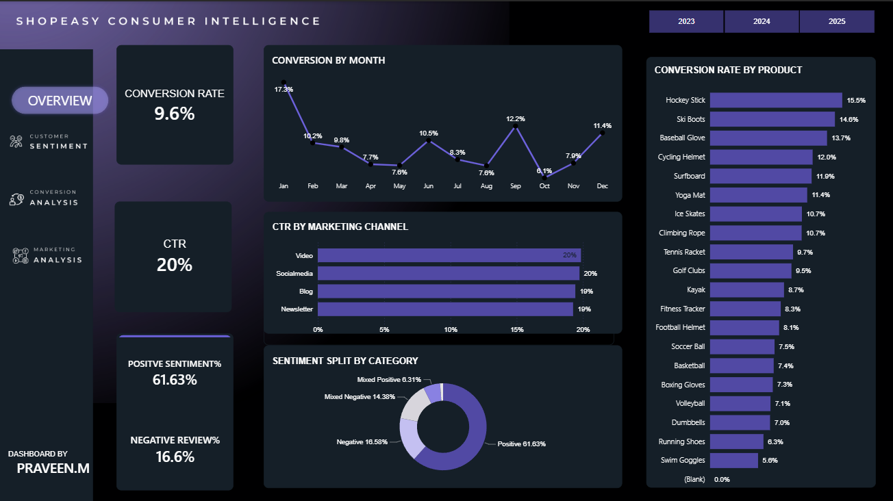
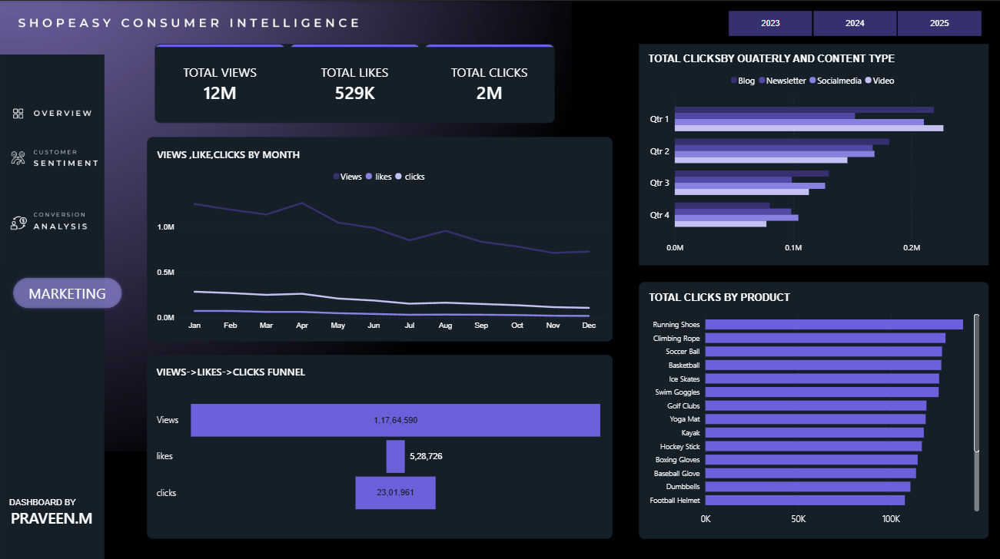
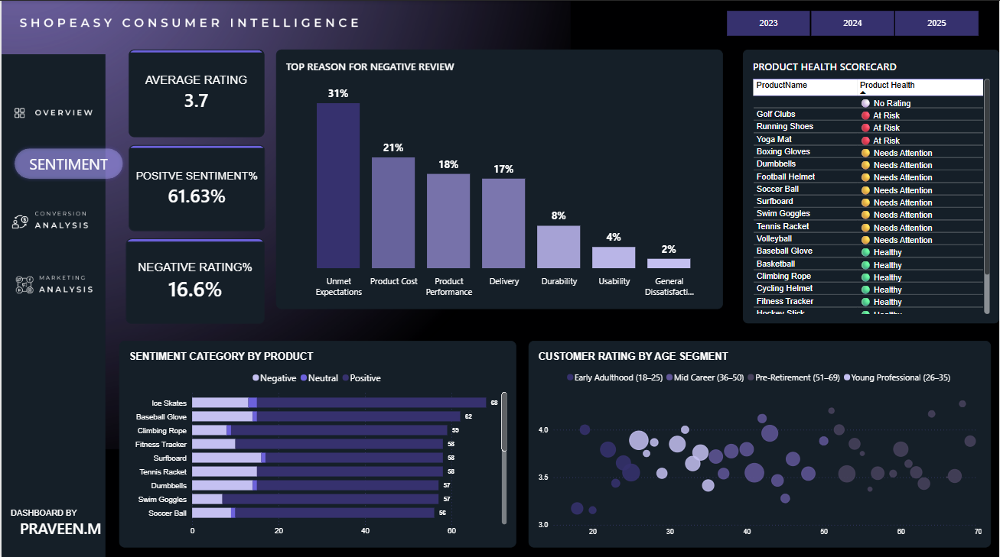

# ShopEasy Consumer Intelligence Funnel and sentiment analysis | End-to-End Behavioral Analysis
**SQL Server · Python · Power BI · NLP Sentiment Analysis**

---

## Executive Snapshot (3-Minute Read)

**Business Context**
ShopEasy's leadership identified a gap between marketing investment and actual purchase conversion. Despite strong top-funnel engagement, revenue growth was not keeping pace with traffic. This analysis was commissioned to diagnose where customers were dropping off, why sentiment was declining, and which products were silently underperforming — before these issues became visible in the P&L.

<h3>Dashboard Walkthrough</h3>

## Key Findings ##
- 96% of all drop-offs occur at Checkout (575 of 598) — the business has a bottom-funnel problem, not a traffic problem
- Click → Purchase rate is only 19% despite a 51% View → Click rate — revenue is leaking at the final step
- Combined negative sentiment is ~31% — nearly 1 in 3 customers are dissatisfied
- Unmet Expectations is the #1 complaint at 31% of negative reviews — a product description gap, not a product quality problem
- Running Shoes has the highest click volume (100K+) but is classified At Risk — marketing spend is being wasted on a failing product

**Why This Matters**
A business can appear healthy on topline metrics while hiding structural problems underneath. This analysis joins three data sources — journey behavior, review language, and engagement data — to surface the hidden signals that aggregate dashboards miss.

## Actionable Recommendations ##
- Audit and simplify checkout UX — improving Click→Purchase from 19% to 25% generates ~35 additional purchases per cycle
- Rewrite product descriptions for At Risk products — reducing unmet expectations by 50% shifts ~38 customers from negative to neutral/positive sentiment
- Pause paid promotion on Running Shoes until product performance issues are resolved
- Reverse-engineer Q1 campaign strategy and replicate in Q3/Q4 to recover declining engagement

> *Note: This project uses a simulated dataset. The 9.6% conversion rate exceeds the 2–4% industry average — figures should be interpreted directionally.*

---

## 📌 Project Overview

This project delivers an end-to-end consumer behavior analysis for ShopEasy, a fictional retail company, using SQL Server, Python, and Power BI.

The business question: *"How can ShopEasy leverage consumer shopping data to identify conversion bottlenecks, improve engagement, and optimize product and marketing strategy?"*

As the analyst on this project, the focus was on three goals — diagnosing funnel drop-off, understanding what drives negative sentiment, and building a composite product health framework that no single metric could produce alone.

---

## 📊 Executive Summary

<h3>Dashboard Overview</h3>

### Conversion Funnel
- Overall conversion rate: **9.6%** (cleaned) vs 8.5% raw — a 1.1pp gap that validates the cleaning investment
- View → Click: **51%** — strong top-funnel engagement
- Click → Purchase: **19%** — sharp collapse at the final step
- **96% of drop-offs occur at Checkout** — customers are reaching the final stage but not completing

Implication: The awareness and interest problem is solved. The purchase completion problem is not.

---

### Marketing Performance
- Total reach: **12M views, 2M clicks, 529K likes** across all campaigns
- CTR is consistent across all four channels: Video (20%), Social Media (20%), Blog (19%), Newsletter (19%)
- No single channel outperforms others — channel mix is not the problem
- **Engagement declining Q1 → Q4** uniformly — Q1 is ~2x Q4 across all content types

Implication: The engagement decay is seasonal and affects all channels equally — it is a campaign strategy problem, not a channel mix problem.

---

### Customer Sentiment
- Positive: **61.63%** | Negative: **16.58%** | Mixed Negative: **14.38%**
- Combined negative signal: **~31%** — nearly 1 in 3 customers dissatisfied
- Average rating: **3.7 / 5** — below the 4.0 threshold considered strong in retail
- **Unmet Expectations = #1 complaint at 31%** of negative reviews
- Product Cost: 21% | Product Performance: 18% | Delivery: 17%
- **Customer Service complaints = 0%** — a strong operational positive signal

### Product Health Scorecard
Built a composite score across Conversion Rate, Average Rating, and % Positive Sentiment — because no single metric fully captures product health.

| Status | Products |
|---|---|
| 🔴 At Risk | Golf Clubs, Running Shoes, Yoga Mat |
| 🟡 Needs Attention | Boxing Gloves, Dumbbells, Football Helmet, Soccer Ball, Surfboard, Swim Goggles, Tennis Racket, Volleyball |
| 🟢 Healthy | Baseball Glove, Basketball, Climbing Rope, Cycling Helmet, Fitness Tracker, Hockey Stick |

Critical signal: Running Shoes is At Risk across all three dimensions while simultaneously receiving the highest marketing click volume.

---

## 🔍 Insights Deep Dive

### Conversion
- **Hockey Stick leads at 15.5%** conversion — Swim Goggles lowest at 5.6% — a 3x performance gap between best and worst
- **Baseball Glove: 0% conversion despite 95 views** — customers browsing but not buying; product page failing to convert intent
- High price products convert better than low price — premium buyers show more committed purchase intent

### Marketing
- **Running Shoes: highest product clicks** — Football Helmet: lowest — 2x product-level engagement gap
- January peaks across all engagement metrics — Q4 is consistently the weakest period

### Sentiment
- Dissatisfaction is not demographic — no age segment significantly differs in ratings
- Mixed Negative customers (text negative, rating acceptable) represent a hidden churn risk that star ratings alone would miss

---

## ✅ Recommendations

### Short-Term (Conversion & Checkout)
- Audit checkout UX — simplify payment steps, add trust signals, offer guest checkout
- A/B test checkout flow to identify specific friction points reducing Click→Purchase from 19%
- Improving to 25% Click→Purchase generates ~35 additional purchases per cycle

### Medium-Term (Sentiment & Product)
- Rewrite product descriptions and add realistic customer photos for At Risk products
- Reducing unmet expectations by 50% shifts ~38 customers from negative to neutral/positive sentiment
- Pause paid promotion on Running Shoes until performance issues are resolved
- Introduce value bundles or clearer value messaging for products with high cost complaints (21% of negative reviews)

### Long-Term (Engagement & Strategy)
- Audit Q1 campaigns to identify what drove peak engagement — replicate in Q3/Q4
- Address the uniform seasonal engagement decay before scaling marketing spend

---

## 🧠 Key Analytical Decisions

*The judgement calls that shaped this analysis — not just what was done, but why.*

- **Negative review theme extraction grounded in word frequency** — Filtered 233 negative reviews and ran word frequency analysis to identify dominant complaint vocabulary before building keyword categories. Categories are data-driven (e.g. "Unmet Expectations" emerged from `meet`, `expectations`, `average` appearing 38x each) — not assumed. Keyword matching does not handle sarcasm; TF-IDF or BERTopic would be more accurate at scale.

- **VADER + Star Rating hybrid sentiment** — Pure VADER scored "The quality is top-notch" as 0.0000. Hybrid categorisation adds star rating context, producing five categories including Mixed types that pure NLP misses.

- **Composite Product Health Score** — No single metric fully captures product risk. Thresholds derived from actual data distribution — not arbitrary cutoffs.

- **Centralised Calendar dimension** — Three fact tables with independent date columns need a shared date dimension for a single slicer to cross-filter all three simultaneously.

- **Logical duplicate detection over primary key trust** — `JourneyID` guarantees no technical duplicates, not business ones. `ROW_NUMBER()` over CustomerID + ProductID + VisitDate + Stage + Action found 79 duplicates the PK would have missed.

- **NULL Duration preserved, not imputed** — 100% of NULLs belong to Drop-off rows. Imputing would have invented data that never existed.

- **COLLATE for casing detection** — `SELECT DISTINCT` passed Stage and ContentType as clean. `COLLATE Latin1_General_CS_AS` exposed 6 and 12 hidden variants respectively.

- **Physical tables over views** — Views re-execute on every access. Physical tables provide a stable, auditable base for both Python and Power BI connections.

---

## 🔍 Data Quality Audit Summary

| Table | Issue | Finding | Action |
|---|---|---|---|
| customer_journey | Logical duplicates | 79 (PK-invisible) | Removed via ROW_NUMBER() |
| customer_journey | NULL Duration | 613 — all Drop-offs | Preserved — intentional system behavior |
| customer_journey | Stage casing | 3 lowercase variants | COLLATE + UPPER() |
| customer_reviews | ReviewText whitespace | Leading/trailing spaces | TRIM() + REPLACE() |
| engagement_data | ContentType casing | 3 variants per value | Standardised |
| engagement_data | Combined metric column | Views + Clicks as "1500-300" | Split into two integer columns |

| Table | Raw | Cleaned | Change |
|---|---|---|---|
| customer_journey_cleaned | 4,011 | 3,932 | −79 logical duplicates |
| customer_reviews_cleaned | 1,363 | 1,363 | Structural cleaning only |
| engagement_data_cleaned | 4,623 | 4,623 | Casing + column split |

The SQL files used to validate and clean this data can be found here: [01_validation.sql](01.Data_Validation.sql) · [02_cleaning_transformation.sql](02_cleaning_transformation.sql)

 Power BI dashboard can be found here: [Download Dashboard](shopeasy_consumer_intelligence.pbix)

---

## 🛠️ Tools Used

- **SQL Server** — Data validation, cleaning, and transformation
- **Python** — NLP sentiment pipeline (VADER + keyword theme extraction)
- **Power BI** — Interactive 5-page dashboard with DAX measures and composite scoring

---

## ⚠️ Assumptions & Caveats

- Dataset is simulated — all figures should be interpreted directionally
- Incomplete time periods excluded from trend analysis to prevent distorted quarter-over-quarter comparisons
- Product Health Score uses equal weighting across three metrics — real-world scoring would apply business-weighted priorities
- VADER lexicon gaps addressed via hybrid categorisation — Mixed categories are estimates, not ground truth

---

## 📬 Contact and Feedback

This project was developed as part of a portfolio demonstrating end-to-end data analysis capabilities across SQL, Python, and Power BI.

**Data Analyst:** Sinha Shrestha

**GitHub:** [Profile](https://github.com/sinhashrestha)

**Email:** sinhashrestha0@gmail.com

---

*Analysis Period: 2023–2025 | Data Source: Simulated retail dataset | Tools: SQL Server · Python · Power BI*
